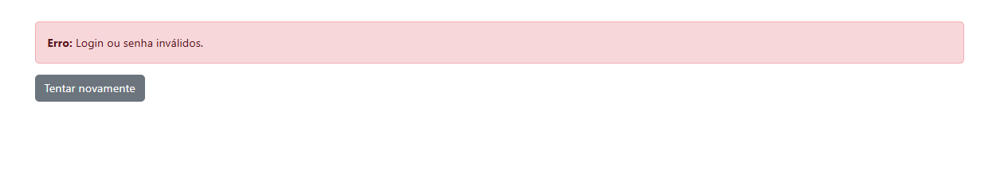
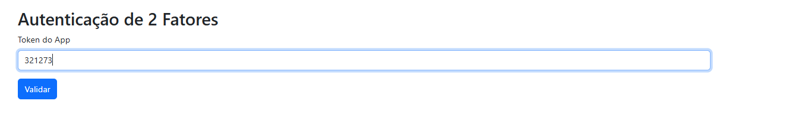
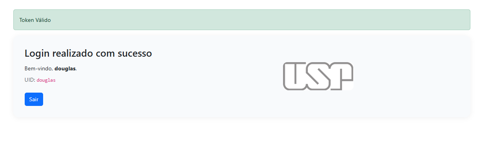

# Atividade FastAPI — Grupo 6
### Douglas Souza - NUSP 10748048
### Guilherme Tutiya - NUSP 

# Descrição do projeto
Este projeto consiste em uma aplicação de login desenvolvida em FastAPI.
A base utilizada foi um programa prévio feito em Flask durante o estágio, sendo necessário adaptá-lo para o uso no framework FastAPI.

O sistema realiza autenticação de usuários registrados em uma tabela chamada usuarios_douglas, criada via ORM do SQLAlchemy.
A funcionalidade de criação de novos usuários não está disponível diretamente pela interface da aplicação — ela foi implementada em um script .py separado.

## Iniciando o projeto 
as informações que estão ausentes do repositorio é o .env que diz respeito com a conexão do banco do grupo 6, e para registrar os usuarios que são possiveis de cadastrar no banco criei uma tabela chama usuarios_douglas usando um models em ORM de slqaclhemy e 
deixei um requirements com tudo q é necessario para ter no virtualenv para executar o codigo, não fiz a funcionalidade de add um novo usuario na propria pagaina ficou para um .py separado, 

### Como executar 

```bash 
python -m venv venv
source venv/bin/activate # Linux / macOS
venv\Scripts\activat # Windows

pip install -r requirements.txt
```
no caso como ja criei a tabela usuarios_douglas não ira precisar rodar o create_db.py mas inclui pois ele fez parte do processo da atividade 

rode a aplicação 

```bash 
uvicorn app.main:app --reload
```

### Teste prático 

Registramos o usuario "douglas" com a senha "douglas" e totp "J6YNUFMGCBWQDTHJJ6BR4WA63UGSBTOT"  e usamos o site https://totp.danhersam.com/ para poder gerar o tkn, mas pode ser qualquer um de sua preferencia, 

### Exemplo em imagens do funcionamento

Exemplo da aplicação na sua tela inicial em login

Exemplo ao entrar com um login que não está registrado na tabela usuarios_douglas

Tela que aparece ao efeturar o login

Tela final apos executar o login de forma correta com o 2fa
